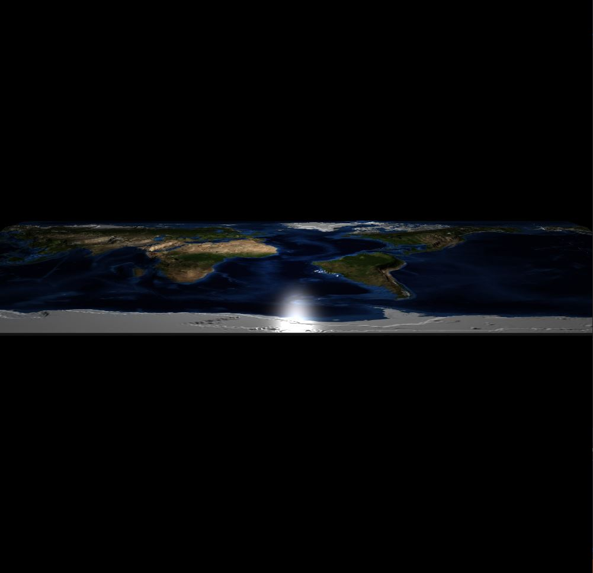
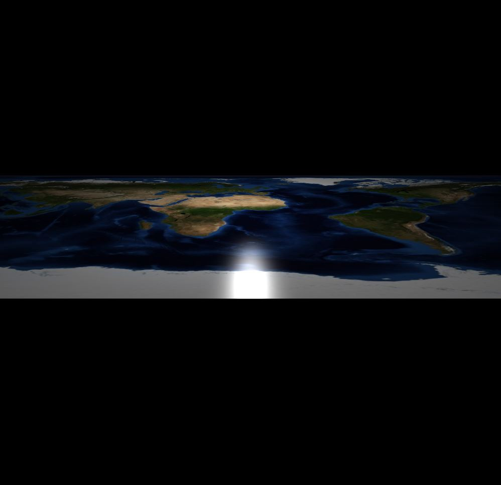
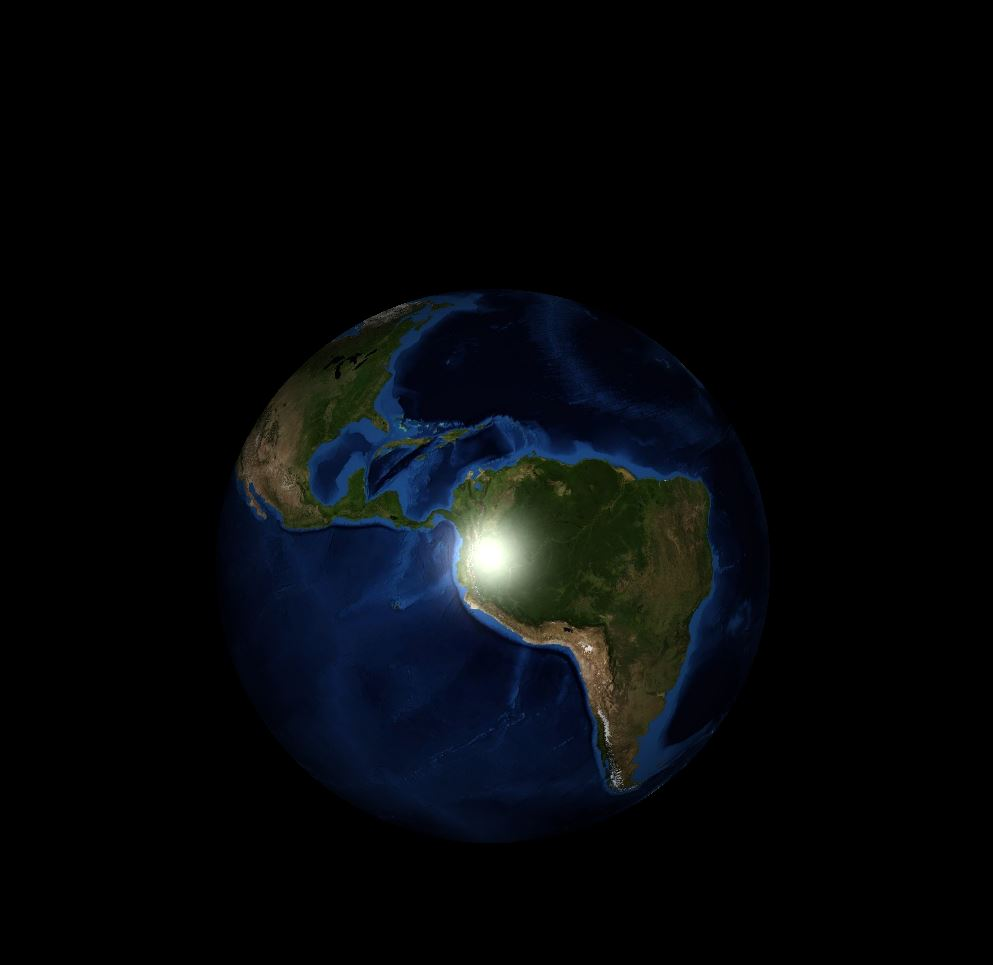
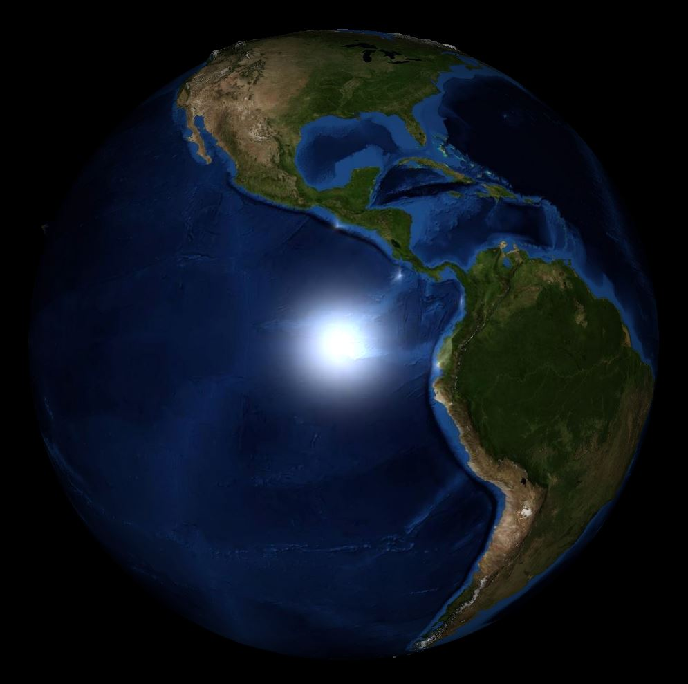

Earth visualisation both in flat and sphere form implemented with OpenGL and C++. Different libraries used such as jpeglib, glm, etc. to ease the implementation. Glfw and glew are expected to be installed in the system.

This project is created to run on linux.

Compile the project using <b>make all</b> command. 

In the base directory:

To run flat earth: <b>./flat_earth height_gray_mini.jpg normal_earth_mini.jpg</b>

To run spherical earth: <b>./spherical_earth height_gray_med.jpg normal_earth_med.jpg</b> 

After running the program following keys can be used for different actions.

W -> Pitch up

S -> Pitch down

A -> Yaw left

D -> Yaw right

Q -> Move map to the right

E -> Move map to the left

T -> Move light up

G -> Move light down

R -> Increase the height of the map

F -> Decrease the height of the map

Y -> Increase the speed of the player

H -> Decrease the speed of the player

Some example visuals: 

