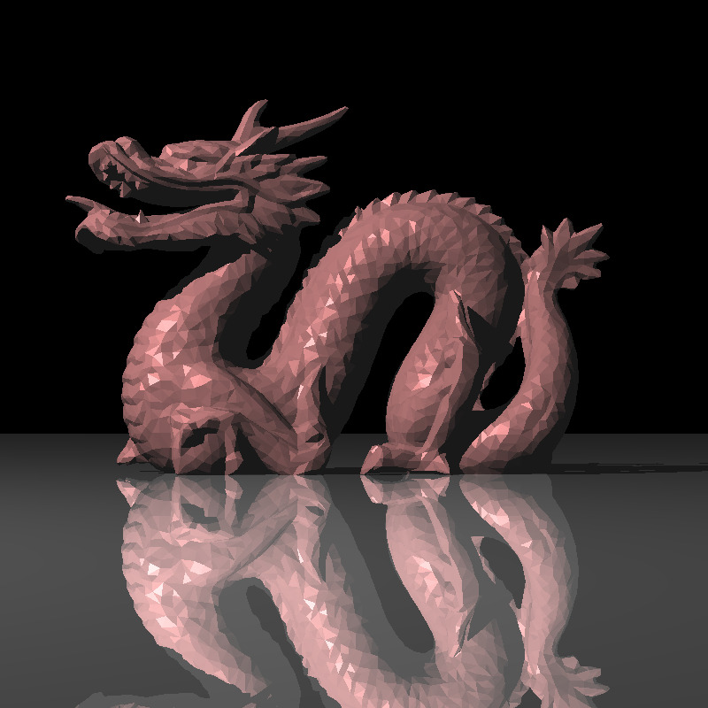
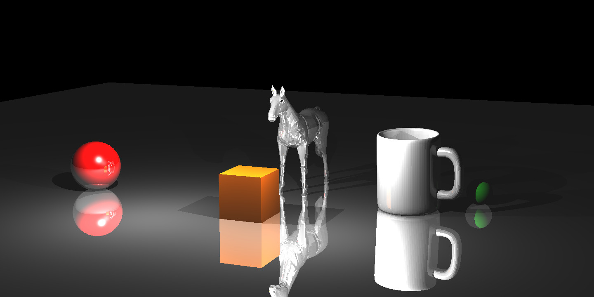
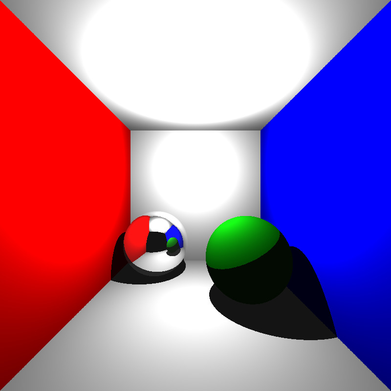

<b>Ray Tracer</b>

Simple Ray Tracer implemented purely in C++.

Compile using makefile.
Input is given in the form of xml file.

Run the program by typing ./raytracer <input_xml_file>.
The output file will be saved in the working directory as a ppm file.

Some example jpeg outputs for the input scenes:  

