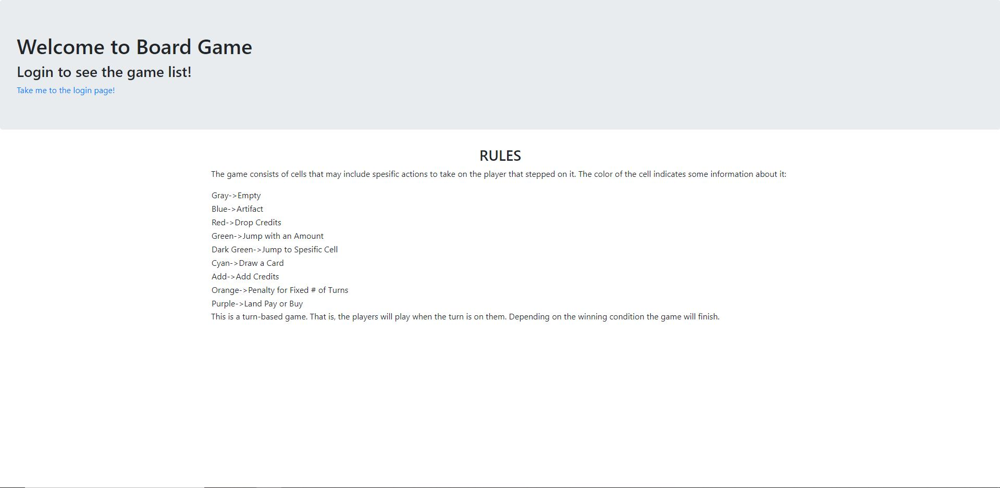
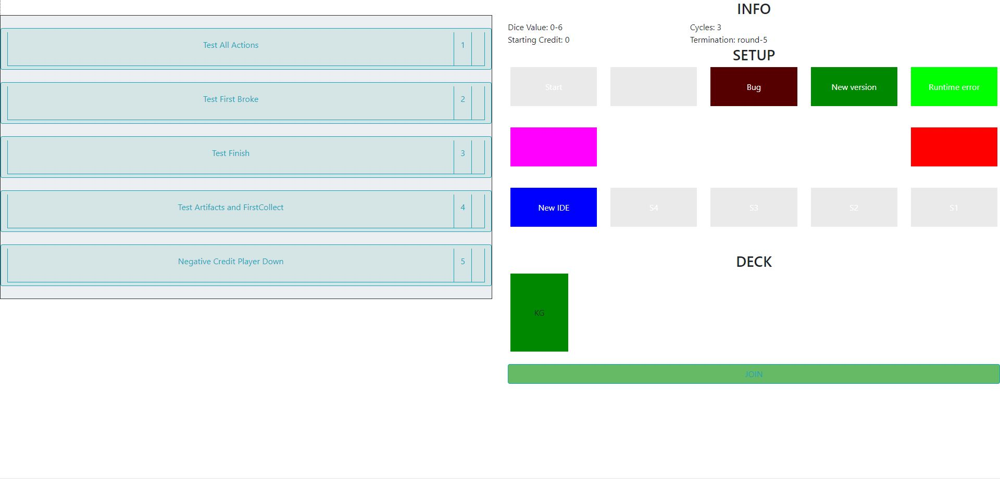
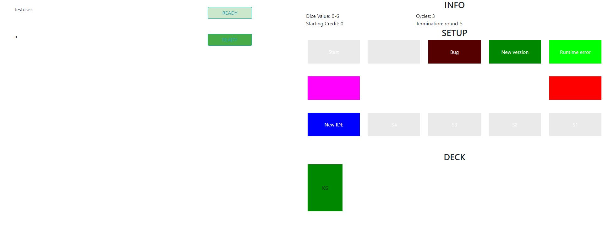
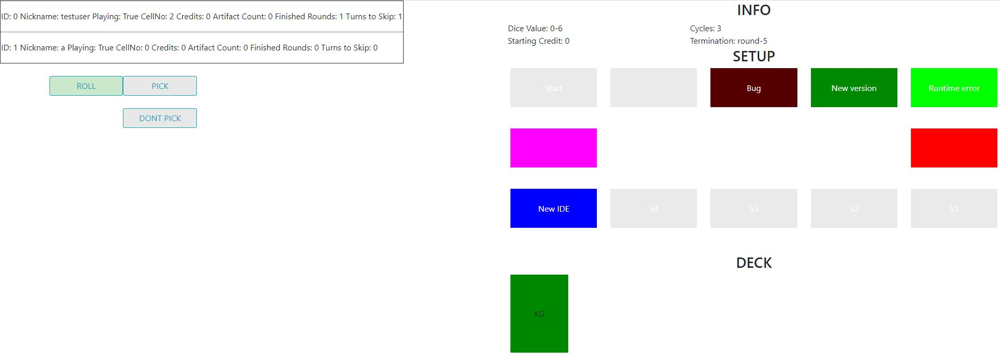

<b>Web-based board game.</b>

Core back-end game features are implemented with python. Django and javascript is used for running the game on the web.

This project is implemented phase by phase. Currently, back-end is finished and front-end is in the progress. New front-end features are going to be added and the existing ones will be improved.

The project is in its last phase, which is Phase4, where is the project will be finalized soon.

In order to play the game, first in the main directory run to initialize the server:

python manage.py runserver

After that, you can use your browser to open the page 127.0.0.1:8000

You can register then login to play.

Since the front-end is not fully implemented visuals are not good enough and ui may have some problems.

The test configurations currently available as game rooms. 

Pictures from the game:  

Landing Page:

Game List:

Game Lobby:

In-game:

